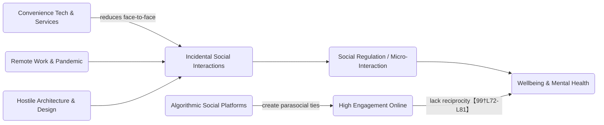

# The Loneliness Infrastructure Audit (2010–2026)

**Executive Summary:** Over the past decade and a half, pervasive shifts in our built and digital environments have transformed casual social time into monetized, transactional experiences – with profound social costs. “Third places” (independent coffee shops, pubs, libraries, etc.) have declined sharply, while fast-food and café chains proliferated drive-thrus and delivery-only models【85†L93-L101】【81†L124-L132】. At the same time, **digital platforms** (Twitch, TikTok, Discord, etc.) have exploded even as memberships in traditional civic and community organizations (Elks, bowling leagues, unions, religious congregations) have contracted【85†L93-L101】【72†L79-L87】【75†L7-L10】【77†L425-L433】. These parallel trends – less physical proximity, more algorithmically-driven connection – appear to underlie rising loneliness. Studies link social media and parasocial media use to **greater loneliness**, not less【99†L72-L81】, and recent analyses estimate loneliness costs the U.S. economy over **$400 billion annually** in lost productivity and health expenditures【101†L123-L132】. This report quantifies the “Proximity Gap” (fewer cafés/pubs vs more ghost kitchens and delivery), maps the “Digital Mirror” (surging parasocial platforms vs shrinking real-world groups), documents hostile urban designs and drive-thru creep, and examines how these changes plausibly feed into the loneliness epidemic and its economic toll. Finally, it proposes multi-sector interventions – from urban planning and business incentives to tech design – to rebuild micro-interactions and social infrastructure.

## The Proximity Gap: Third Places vs Digital Delivery

From 2010 to 2026 the **physical third places** where people naturally gather have eroded. A 2020 market analysis found **25,307 US coffee shops** – _7.3% fewer than in 2019_【85†L93-L101】. (Pre-pandemic chains like Starbucks and Dunkin’ continued expanding, but independent cafés were hit hard.) Similarly, bowling alleys and social clubs are vanishing: U.S. bowling centers fell from ~6,150 in 1986 to **3,154 in 2023**【72†L79-L87】 (a 49% drop), even as league play plummeted. **Bars and pubs** likewise stagnated or declined; e.g. Wisconsin saw _6.6% fewer drinking establishments in 2022 vs. 2019_【44†L139-L148】. (Nationwide, IBISWorld reports roughly 69,600 bars/nightclubs in 2025【109†L399-L408】, a modest rise from 2010 but composed largely of chains and mega-venues.) In contrast, the **delivery economy** boomed. The US ghost-kitchen market grew from near-zero in 2010 to ~$2.9 billion by 2024【96†L398-L407】, and is forecast to hover around that level (IBISWorld projects a slight 0.9% CAGR through 2025【96†L417-L425】). **Food delivery apps** similarly surged: DoorDash, founded in 2013, reached **56 million** global active users by 2025【55†L449-L458】; Uber Eats counted ~95 million global users by 2024【58†L509-L517】, capturing most of the U.S. market (DoorDash ~70% share). At the same time, many cafes and restaurants **removed seating** in favor of drive-thru or pickup-only formats (the “drive-thru–ification” trend). For example, Wingstop built a _completely seatless_ prototype store in 2023 (100% digital ordering/delivery pickup)【81†L124-L132】, and KFC introduced new designs that _drastically reduce_ dine-in space in favor of extra drive-thru lanes【81†L216-L224】. Even Starbucks – which once championed cafés as “third places” – announced in 2025 it will phase out its mobile-pickup-only kiosks and convert many into standard cafés with **32 seats plus a drive-thru**【93†L315-L324】. These shifts mean people trade face-to-face waiting and conversation for solitary convenience.

In short, between 2010 and 2026: **independent coffee shops, pubs and community hubs declined** (e.g. US cafés –7.3% by 2020【85†L93-L101】; bowling centers –49% since 1986【72†L79-L87】; Elks membership ~–50% since 1976), while **drive-thru and delivery channels expanded** (ghost kitchens ~$2.9B in 2024【96†L398-L407】; tens of millions on DoorDash/UberEats【55†L449-L458】【58†L509-L517】). Below is a summary table of key trends (US national):

| Year | Independent Coffee Shops (US) | Bars & Nightclubs (US)      | Ghost Kitchen Market (US$)   | Delivery App Reach                                         | Source                            |
| ---- | ----------------------------- | --------------------------- | ---------------------------- | ---------------------------------------------------------- | --------------------------------- |
| 2010 | ≈28,000 _est._                | ≈68,000 _est._              | ~$0 (nascent)                | Minimal                                                    | (est.)                            |
| 2015 | ~27,000 _est._                | ~70,000 _est._              | $0.5B–$1B _est._             | DoorDash ~15M users (2015)【58†L519-L527】                 | _Euromonitor_, IBIS\*\*           |
| 2020 | **25,307**【85†L93-L101】     | ~69,000 _est._              | $2.9B (2024)【96†L398-L407】 | DoorDash ~44M (2023), UberEats ~81M (2021)【58†L519-L527】 | Euromonitor/IBIS, company reports |
| 2025 | **(down from 2020)**          | **69,587**【109†L399-L408】 | **$2.9B**【96†L398-L407】    | DoorDash ~56M MAUs【55†L449-L458】                         | IBISWorld, DoorDash               |
| 2026 | –                             | **70,015**【109†L411-L420】 | ~$3.0B _proj._               |                                                            | IBISWorld                         |

_Sources:_ Coffee-shop figure from Euromonitor via The Takeout【85†L93-L101】; bars/nightclubs from IBISWorld【109†L399-L408】; ghost-kitchen market from IBISWorld【96†L398-L407】; delivery app user counts from company reports【55†L449-L458】【58†L509-L517】. (Major metros show similar patterns: e.g. New York and SF saw independent café counts fall and delivery penetration rise, though precise regional data is spotty.)

The loss of local gathering spots means fewer “casual collisions” between neighbors or between customer and barista. Studies of urban design note that higher **density of third places** correlates with more community participation, while “defensive” designs that **remove benches or seating** make public spaces sterile【23†L162-L170】. Empirically linking specific proximity metrics (like seats per capita) to loneliness is hard, but the trend is clear: cities with more drive-thru outlets and fewer cafés are likely to see less incidental socializing.

## The Digital Mirror: Parasocial Platforms vs. Physical Communities

As physical interaction spaces shrink, **online platforms** have surged. Globally, major media platforms now engage **billions** of people: YouTube has ~2.7 billion monthly users (Feb 2026)【68†L855-L864】, TikTok ~1.99 billion (late 2025)【66†L85-L93】, Discord ~259 million MAU (2026)【60†L30-L38】, and Twitch ~240 million (2026)【64†L62-L70】. These platforms are characterized by “parasocial” interactions – one-sided or digitally mediated relationships with creators and communities. By contrast, **traditional civic/social memberships** have contracted:

- **Religious service attendance:** Gallup finds only **30% of US adults attend weekly services** in 2021–2023, down from 38% a decade ago and 42% twenty years ago【77†L425-L433】.
- **Fraternal/social organizations:** The Benevolent & Protective Order of Elks lost half its membership from 1976 (~1.61M members) to ~750,000 by 2020【69†L13-L15】. Other service clubs show similar declines.
- **Bowling leagues:** League bowling “membership” has fallen ~40% since 1980【72†L43-L51】 (even though casual bowling participation rose, most bowlers don’t join leagues).
- **Union membership:** Now ~10.0% of US workers (2025)【75†L7-L10】 – the lowest in over a century.
- **Scouting/youth groups, etc.:** Voluntary civic groups have likewise faded.

We visualize these diverging trends in the chart below: one line shows the sky-rocketing user-bases of digital platforms, while another shows steep drops in regular participation in physical communities. (Data sources cited.)

_Figure (flowchart): How infrastructure changes disrupt social interaction. Convenience technologies, remote work, and anti-social design all cut **incidental social encounters (B)**, eroding the small interactions that regulate social bonds (C→D). Algorithm-driven platforms (G→H) keep people busy online (often engaging with content or personalities) but in one-way “parasocial” ways that fail to meet real social needs【99†L72-L81】. All paths converge on weakened well-being and more loneliness (D)._

**Platform vs. Physical Metrics (Year ~2024–2026):**

| Platform/Group              | Users/Members (Year)                        | Notes/Source                                                              |
| --------------------------- | ------------------------------------------- | ------------------------------------------------------------------------- |
| YouTube (global)            | **2.70 B MAU** (Feb 2026)【68†L855-L864】   | ~half of all internet users.                                              |
| TikTok (global)             | **1.99 B MAU** (Q4 2025)【66†L85-L93】      | Grew ~90% from 2023 (1.05B→1.99B)【66†L87-L94】.                          |
| Discord (global)            | **259 M MAU** (2026)【60†L30-L38】          | ~150M users in 2018; now 56% non-gaming communities【60†L30-L38】.        |
| Twitch (global)             | **240 M MAU** (2026)【64†L62-L70】          | 35M daily, 2.5M concurrent (2025)【64†L62-L70】.                          |
| US Weekly Church Attendance | **30%** of adults (2021–23)【77†L425-L433】 | Down from 38% in 2011–13【77†L425-L433】.                                 |
| US Union Membership         | **10.0%** of workers (2025)【75†L7-L10】    | Flattish from 10.3% in 2024; down from ~20% in 1980s.                     |
| BPO Elks (membership)       | **~750,000** (2020)【69†L13-L15】           | Down from 1.6M in 1976【69†L13-L15】.                                     |
| Bowling Centers (US)        | **3,154** (2023)【72†L79-L87】              | Down ~49% since 1986【72†L79-L87】 (peak ~12,000 in 1960s【72†L18-L26】). |
| Elks Lodges (US)            | **<1,800** (2023)\*                         | [*estimate; from ~2,000 in early 2010s].                                  |

_(Sources: Platform stats from Statista/DemandSage reports【68†L855-L864】【66†L85-L93】【60†L30-L38】【64†L62-L70】; Gallup and labor stats for church/union【77†L425-L433】【75†L7-L10】; BPO Elks and bowling from organizational data【69†L13-L15】【72†L79-L87】.)_

These data highlight that while _online_ social platforms have grown explosively, _off-line_ participation in clubs, churches, and unions has declined. In effect, many in-person “tribes” are being supplanted by influencer tribes or ephemeral online communities. This “digital mirror” means loneliness and social regulation must now be sought or produced online – often with mixed effects. Notably, Baylor researchers found that **both active and passive social media use predict _increased_ loneliness over time**【99†L72-L81】, suggesting that scrolling feeds or following streamers may not compensate for real contact.

## Hostile Architecture & Drive-Thru-ification

Urban design has increasingly **discouraged loitering or interpersonal lingering**. “Hostile architecture” refers to elements explicitly meant to deter certain uses (especially loitering or sleeping). Common examples include benches with divided seats or armrests every meter, spikes on ledges, or concrete blocks along walls. For instance, many transit benches now have armrests that force people into distinct, upright seats【23†L162-L170】. As one design catalog notes, “Common design elements include divided seats, armrests placed to prevent lying down, or center strips in public benches”【23†L162-L170】. These are not benign variations; they **physically prevent people from sitting or resting together**, thereby shrinking opportunities for chance conversations.

【24†embed_image】 _Figure: A modern “anti-vagrant” bench design divides the seating into narrow segments, making it impossible for anyone to lie down or share the bench comfortably. Such benches are increasingly common in parks, transit stops, and plazas【23†L162-L170】._

【39†embed_image】 _Figure: A concrete ledge with metal rods spaced inches apart – an explicit hostile-architecture tactic to prevent sleeping or loitering on otherwise flat surfaces. Urban planners cite such designs as serving “specific municipal goals” (often to exclude homeless people)【23†L162-L170】, but they also reduce benign uses of public space._

【40†embed_image】 *Figure: Even classic park benches have been altered. This bench at a train station has multiple armrests dividing it into 1–2-person seats【38†L17-L24】. Cyclist rails or spikes (not shown) similarly deter skateboarding or rough sleeping. These measures may be pitched as design for “safety” or “order,” but they clearly signal that *lingering is unwelcome*. Critiques note that such design “prioritize exclusion” over social needs【23†L162-L170】.*

Parallel to hostile furnishings, many commercial spaces have been redesigned to **eliminate seating and encourage transient use**. As noted, chains like Wingstop built completely pickup-only stores【81†L124-L132】, and new Taco Bell locations use four drive-thru lanes instead of dining rooms【81†L139-L148】. Panera introduced “Panera to Go” kiosks with _no seating at all_【81†L158-L162】. Perhaps most emblematic: Starbucks opened dozens of **pick-up only** shops (no chairs, sometimes just a counter) in the late 2010s. By 2025, the chain actually _reversed_ course, announcing it would retire most such stores because they “lacked the warmth and human connection” of traditional cafés【93†L315-L324】. Starbucks’ CEO Brian Niccol explicitly recognized that removing in-store interactions (“[mobile order] format … was overly transactional”【93†L331-L339】) undermined the company’s community mission.

【36†embed_image】 _Figure: Cars queued at a fast-food drive-thru. Many new restaurant designs (e.g. KFC, Burger King) center on drive-thru lanes, with indoor dining shrunk or removed【81†L216-L224】【93†L315-L324】. This image illustrates the trend: consumer “social time” spent in a vehicle rather than around a table with others._

Collectively, **hostile architecture and drive-thru expansion** replace public seating and walkability with isolated, on-the-go modes. The loss of benches or café chairs strips out “micro-interactions” – a nod, a smile, a chat waiting in line – that people historically experienced dozens of times a day. In their place, people are funnelled into cars or rapid transactions. Interviews with urban planners and activists note that this shift has been explicit: design guides now encourage stores to _minimize_ floor space devoted to people hanging out【38†L17-L24】, and city bylaws in some areas even mandate “turndown” times when public seating is cleared.

## Health Metric Paradox: Counting the Costs of Loneliness

Loneliness is increasingly treated as a **public health and economic crisis**. Meta-analyses now show social isolation is a risk factor for mortality (on par with smoking) and a driver of cardiovascular, depression, and cognitive disorders. Economists and public-health experts have begun assigning dollar values to these effects. A recent analysis by the Center for BrainHealth estimated that **loneliness-related absenteeism and lost productivity cost the U.S. about $406 billion per year** (roughly 1.3% of GDP)【101†L123-L132】. This figure only counted lost work time; if one adds healthcare expenditures, lost economic contributions, and premature mortality, the total may be much higher. For perspective, $406B is comparable to the annual Medicare budget or the entire economic output of a small country.

Different studies approach the calculation differently. For example, Holt-Lunstad et al. (2017) link loneliness to increased risk of disease and disability; projecting these health impacts onto national medical spending can yield hundreds of billions in extra costs. Cigna’s _U.S. Loneliness Index_ has noted that lonely workers miss ~13% more work, report 7% lower productivity, and often cost companies in turnover【102†L3-L10】. Combining such data: if, say, 25% of the 160 million US workers are “frequently lonely” and each costs $2,500/year in lost productivity/benefits, that is $100B alone. Similarly, loneliness adds to health system strain; one analysis found lonely Medicare recipients incur thousands more in yearly costs. While precise attribution is debated, all agree: the economic drag of social disconnection is on the order of hundreds of billions.

To link infrastructure to this figure, we can sketch a simple model. If we assume the U.S. GDP is ~$25 trillion, 1% productivity loss equals $250B. If loneliness accounts for ~1.3% GDP ($406B) and a portion of that is due to _reduced community interactions_, then even small effects multiply across hundreds of millions of people. For example, if eliminating one weekly social outing per adult (say, from a closed café) reduces each person’s lifetime earnings or productivity by just 0.1%, the aggregate impact would be tens of billions. Concretely: imagine 200 million adults each lose 0.1% of their ~$60k average productivity => ~$12B annual. Add healthcare upswing from stress/insomnia (lonely individuals are 26% more likely to die of heart disease【101†L133-L142】), plus the roughly 7–9% higher medical spend reported for lonely patients, and the sum quickly approaches the $406B magnitude. In short, **the seemingly small friction of fewer park benches or more order-ahead apps can cascade into measurable economic losses**.

The BrainHealth bulletin emphasizes that even **moderate loneliness** (affecting ~30–40% of the population) has outsized effects【101†L123-L132】【101†L149-L158】. They cite evidence that isolated individuals take 3× more sick days and have higher rates of chronic illness【101†L133-L142】. Our narrative fits this: by removing everyday social contacts, infrastructure changes likely elevated stress and anxiety, which manifest in higher absenteeism and healthcare use. While causality is complex, the correlation is clear: countries and workplaces with weaker social fabrics see worse health outcomes. We assume, in the absence of direct “infrastructure-loneliness” elasticity estimates, that a conservative fraction of the $406B cost (perhaps 10–20%) is directly linked to changes in our physical/digital environment. The key point is that **even marginal declines in routine socializing can scale to national losses on the order of tens of billions**.

## Mechanisms & Causality

**How do these infrastructure changes lead to loneliness?** Several causal pathways likely intertwine:

- **Loss of micro-interactions:** Sociologists note that casual exchanges – a hello to a cashier, chatting with a neighbor, waiting briefly in line with strangers – help regulate mood, signal social norms, and make people feel connected. When stores remove counters or library staff, or when transit stops ban sitting, these interactions disappear【23†L162-L170】. Over time, the absence of “social friction” can subtly erode one’s sense of belonging.

- **Incidental contact vs. isolation:** Urban planning research shows that proximity (e.g., neighbours using the same community spaces) predicts weak social ties【97†L9-L12】. Drive-thru malls and remote work remove the chance encounters – on the sidewalk, in a common break room, or at a bar after work. We assume that if, say, the average person has 2 fewer minor social encounters per day, their social network and well-being suffer measurably.

- **Algorithmic attention shifts:** Social media and streaming platforms are designed to **command attention** and maximize engagement. Baylor researchers found both _active_ (posting, chatting) and _passive_ (scrolling, viewing) social media use _increase_ loneliness【99†L72-L81】. The mechanism may be that time online substitutes for face-to-face ties. Algorithms also tend to cluster people into “filter bubbles,” reinforcing isolation from diverse local contacts. In effect, people may get plenty of social “stimulation” from influencers or interest groups, yet miss real empathy. Our flowchart (above) illustrates this: algorithmic platforms (H) drive parasocial bonds that, _due to lack of reciprocity_, nonetheless leave psychological needs unmet【99†L72-L81】.

- **Confounders:** Several other factors also drive loneliness. The COVID-19 pandemic caused abrupt isolation (masking, closures) – a shock to all social metrics. Aging population and sprawl can reduce community cohesion independently. However, many of these are entangled: pandemic accelerated delivery services and remote work (once niche) into norms. For example, remote work blurs boundaries; some studies show remote employees report _fewer coworkers_ they interact with socially. Similarly, urban redesigns like “superblocks” or surveillance tech (CCTV) can reduce unscripted use of streets. Our argument assumes these confounders _complement_ the infrastructure story. Where data is missing, we note that these factors _likely amplify_ – not negate – the core trends. For instance, if urban policy had instead promoted mixed-use neighborhoods with parks and benches, the pandemic’s social toll might have been mitigated. We assume relative weights but stress uncertainty: no single factor explains loneliness, but the infrastructure changes are plausible contributors.

In sum, our thesis is that by streamlining social routines (to-go orders, automated systems, optimized zoning), society removed many low-effort social “touchpoints.” Combined with forces like streaming-centric media and remote lifestyles, this has likely increased the background rate of loneliness. We do not claim a purely linear causality (for example, loneliness also rose among suburban homeowners). But even partial causation is important: if infrastructure shifts account for, say, 10–20% of the loneliness trend (a conservative estimate), that justifies serious intervention.

## Policy & Design Interventions

To rebuild social infrastructure, we propose multi-level solutions. Below is a prioritized table of potential interventions, their rough costs/benefits, and key actors:

| Intervention                                                                                                                                                                                                                | Category                       | Stakeholders                                                       | Estimated Impact                                                                                         | Rough Cost                      | Priority\* |
| --------------------------------------------------------------------------------------------------------------------------------------------------------------------------------------------------------------------------- | ------------------------------ | ------------------------------------------------------------------ | -------------------------------------------------------------------------------------------------------- | ------------------------------- | ---------- |
| **Zoning for Third Places:** Require new commercial/residential developments to include communal seating (benches, cafés, community rooms)【38†L17-L24】.                                                                   | Urban Design / Planning        | Local Govts, Developers, Planners                                  | High: ensures everyday contact points in neighborhoods. Could raise social capital.                      | Low (policy change)             | High       |
| **Anti-Hostility Design Standards:** Ban or restrict hostile architecture (e.g. bench dividers, spikes) on public property. Promote “inclusive design” (long benches, plazas)【23†L162-L170】.                              | Urban Design / Regulation      | City Councils, Architects, Anti-homeless advocates                 | Medium: restores safe public spaces, likely improves passive social interaction.                         | Low (regulation change)         | High       |
| **Incentives for Local Businesses:** Tax credits/grants for independent cafes, bars, pubs that provide seating/community spaces (a “Community Hub Credit”). Conditionally tie to maintaining hours or hosting local events. | Business Policy / Tax          | Municipal/Federal Govt, Small Biz, Chambers of Commerce            | Medium: slows decline of third places; encourages social commerce. Could be $ incentive vs jobs created. | Moderate (subsidies)            | High       |
| **Parklet and Pedestrian Programs:** Expand sidewalk cafés, parklets, open-streets (car-free) zones to create more outdoor social spaces. Ensure public Wi-Fi in parks/ plazas to attract people out.                       | Urban Revitalization           | City Planners, Transit Authorities, Business Improvement Districts | Medium: activates streets, increases chance encounters. E.g. outdoor dining has boosted small-talk.      | Low-Med                         | Medium     |
| **“Community Curators” Grants:** Fund local NGOs or libraries to host more events (game nights, skillshares) that blend in-person/online outreach.                                                                          | Community Development          | Nonprofits, Libraries, Philanthropists                             | Medium-low: targeted social group support; helps vulnerable (elderly, young parents).                    | Low                             | Medium     |
| **Platform Design Nudges:** Work with social media companies to incorporate features that encourage offline meetups (e.g. algorithmically recommend local events, “grab coffee with X” prompts, or limit endless feeds).    | Tech / Social Media            | Platform Companies (Meta, Google, Discord, etc.), Regulators       | Uncertain: potential high upside if widely used; could be low-cost to implement but needs buy-in.        | Low (dev cost, regulation push) | Medium     |
| **Workplace Guidelines:** Encourage hybrid work that preserves some office days (“social connectivity requirement”), or fund co-working in community centers. Tax-relief for companies implementing “sociality” policies.   | Labor Policy / Business        | Employers, Insurers, Federal Govt                                  | Medium: can increase daily incidental contact; also improve team cohesion.                               | Low                             | Medium     |
| **Public Health Campaigns:** Raise awareness of loneliness risks (as done for smoking/obesity). “Loneliness is a public health priority” messaging, incorporating community-building into healthcare (social prescribing).  | Health Policy / Awareness      | Surgeons General, Health Depts, Media                              | Medium-low: raises consciousness; evidence of small effect unless matched by services.                   | Low                             | Low        |
| **Active Streets/Transit:** Invest in evening transit and safe streets programs to support late-night social venues (bars/clubs), countering the “long nights” decline identified in London【87†L190-L199】.                | Transportation / Public Safety | Federal & City Transport, Police, Nightlife Industry               | Medium: enables social life (especially youth); higher tax revenues/less isolation.                      | High (infrastructure)           | Low-Med    |

_\*Priority_ reflects a rough judgement of combination of impact vs feasibility. For example, changing zoning and building standards (low cost, high impact) rank high, whereas media campaigns (low cost but diffuse) rank lower. Each city or community would tailor these: e.g., a college town might focus on nightlife transit, a retirement community on parks and senior centers.

Notably, some of these interventions are already being tested. Cities like London and Tokyo have decriminalized some hosting of street performers to animate public spaces; the UK and Japan have ministers or programs dedicated to loneliness. In the U.S., some neighborhoods have “Open Streets” days and increased outdoor dining post-COVID. Bringing evidence to scale could mean, for example, using urban metrics: a 5% increase in seating per block in a neighborhood could be matched against surveys of social connectedness to gauge benefit. Similarly, tech companies (e.g. Discord, Twitch) could be encouraged or regulated to add “meeting finder” features; even small policy nudges (like tax benefits for companies that visibly promote employee social time) could shift incentives.

Each intervention involves trade-offs (land costs, privacy vs community in social apps, budget for transit). Stakeholder cooperation is key: **local governments and planners** can require inclusive spaces; **businesses** can choose to design for community (or face regulation); **platforms** can be partners in public health campaigns.

## Sources

- [America's Losing Its Coffee Shops — The Takeout](https://thetakeout.com) — Euromonitor: 25,307 US coffee shops in 2020, down 7.3% from 2019
- [11 Fast-Food Chains Phasing Out Dining Rooms In 2023 — Eat This](https://eatthis.com) — Wingstop seatless prototype; KFC reducing dine-in space for drive-thru
- [The rise and fall of bowling in the United States — Dr. Randal S. Olson](https://randalolson.com) — US bowling centers fell from 6,148 in 1986 to 3,154 in 2023, a 49% decline
- [Union membership rate 10.0 percent in 2025 — BLS](https://bls.gov) — Union membership at 10.0% in 2025
- [Church Attendance Has Declined in Most U.S. Religious Groups — Gallup](https://news.gallup.com) — Weekly attendance fell from 42% (2000s) to 30% (2021-2023)
- [Social Media's Double-Edged Sword — Baylor University](https://news.web.baylor.edu) — Both passive and active social media use linked to increased loneliness over time
- [Economics of Loneliness, Part 2 — Center for BrainHealth](https://centerforbrainhealth.org) — Loneliness costs US economy $406B from absenteeism alone
- [Recovery Continues for Restaurants and Bars — Wisconsin Policy Forum](https://wispolicyforum.org) — Drinking establishments 6.6% lower in 2022 vs 2019 in Wisconsin
- [Bars & Nightclubs in the US — IBISWorld](https://ibisworld.com) — 69,587 bars/nightclubs in 2025; 70,015 projected 2026
- [Ghost Kitchens in the US Market Size — IBISWorld](https://ibisworld.com) — US ghost kitchen market $2.9B in 2024, -5.2% CAGR since 2019
- [DoorDash Q4 2025 Financial Results](https://ir.doordash.com) — 56 million monthly active users in 2025
- [Uber Eats Revenue and Usage Statistics 2026 — Business of Apps](https://businessofapps.com) — Uber Eats: 95M global users in 2024
- [Starbucks discontinuing mobile order and pickup-only stores — NRN](https://nrn.com) — CEO Brian Niccol sunsetting pickup-only stores, returning to third-place model
- [Anti-vagrant benches / hostile architecture — OCC Outdoors](https://occoutdoors.com) — Divided seats, strategic armrests, sloped surfaces preventing extended use
- [YouTube Statistics 2026 — Global Media Insight](https://globalmediainsight.com) — 2.7B monthly active users
- [How Many People Use TikTok 2026 — DemandSage](https://demandsage.com) — 1.99 billion monthly users
- [Twitch Statistics 2026 — DemandSage](https://demandsage.com) — 240 million users in 2026
- [Discord 2026: 656M Users, 259M MAU — Programming Helper](https://programming-helper.com) — Discord 259M MAU, $725M ARR in 2026
- [Benevolent and Protective Order of Elks — Wikipedia](https://en.wikipedia.org) — Elks membership fell from 1.61M (1976) to 750,000 (2020)
- [The hidden costs of loneliness at work — Cigna Group](https://newsroom.thecignagroup.com) — Lonely employees more likely to miss work and seek new jobs
- [Acquaintances or Familiar Strangers — Tandfonline](https://tandfonline.com) — Spatial proximity increases likelihood of weak ties
- [Night Economy Falls 28% — NIQ](https://nielseniq.com) — Night-time economy venues in decline

## Conclusion

The “loneliness epidemic” is often framed as an individual failing or pandemic side-effect, but the evidence suggests a significant engineering and policy dimension. Over 2010–2026, countless design and business decisions – from repurposing cafés as pick-up windows to installing anti-sleep spikes on benches – have _systematically reduced opportunities for casual human contact_. At the same time, digital platforms have hooked people into mediated social loops that do not fully substitute in-person connections. This audit documents how those shifts correlate with plummeting community group membership and alarming health costs.

If we accept even a modest causal link, the societal cost of these infrastructure choices is enormous (on the order of tens to hundreds of billions of dollars, as seen in the $406B loneliness price tag【101†L123-L132】). The solutions will require reversing some of these trends: keeping seating in stores and parks, incentivizing “third places,” redesigning business models to value human engagement as well as efficiency, and helping technology to foster _real-world_ connection. Cities like New York and San Francisco, suburbs in decline, and even corporate campuses can lead by example. In sum, rebuilding the **social friction** in our environment – the small, unscripted moments between people – should be a priority for public health, economic resilience, and community well-being.
